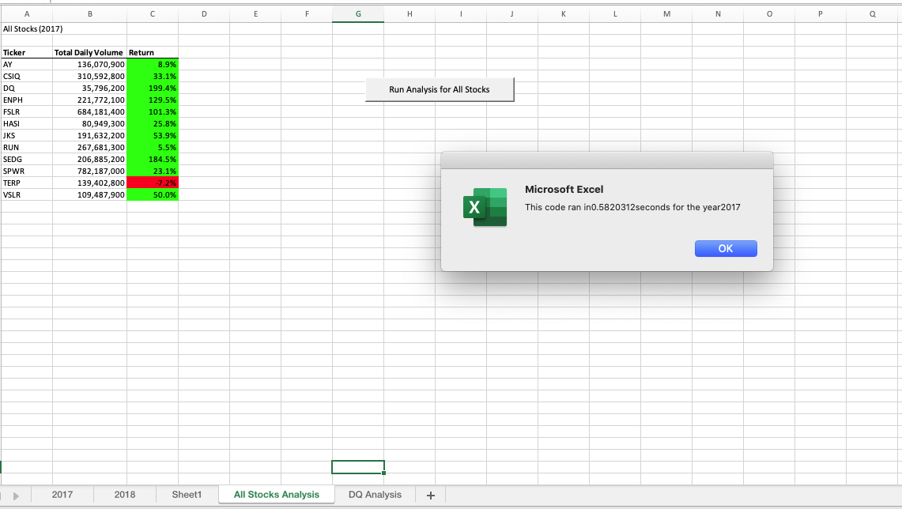
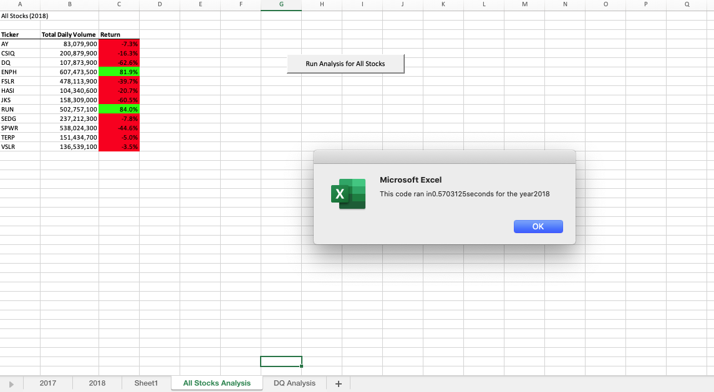
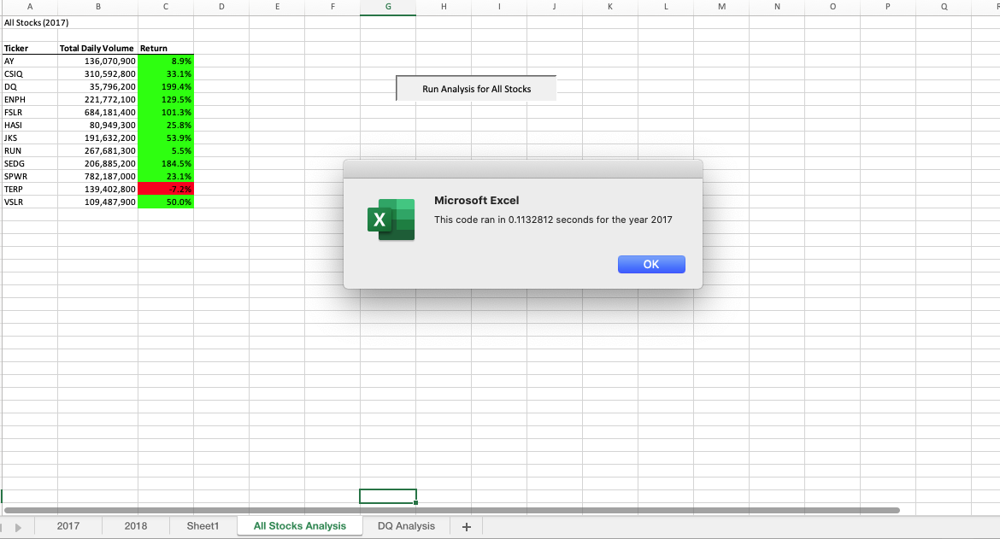
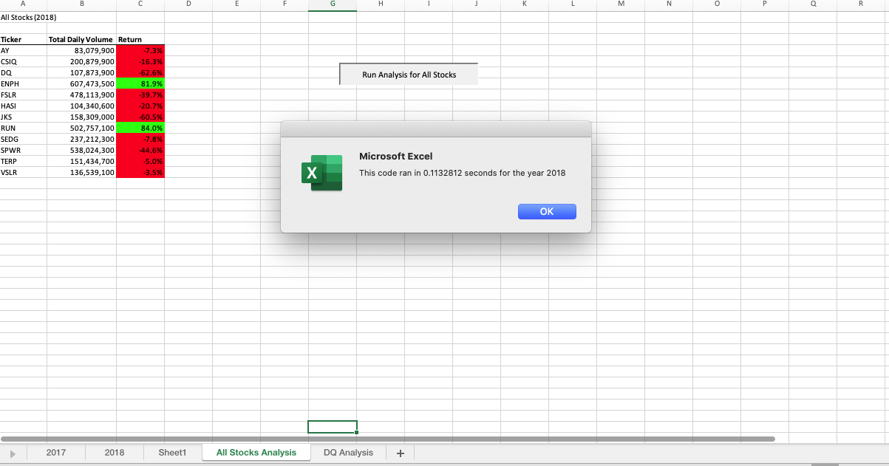

# Green Stocks with VBA Excel

## Overview of Project

### Purpose
The purpose of this analysis is to assist Steve in looking into DAQO stocks for his parents which they have decided to invest all of their money into. Steve is concerned about diversifying their funds and wants to analyze a handful of green energy stocks for alternative stock choices for his parents to choose from.  He wants to find the total daily volume and yearly return for each stock. This will be unraveled by using visual basic for application (VBA) applying on stock performance data between 2017 and 2018, which analyzes the dataset for daily volume and yearly return as well as outputting the execution times of the script. The dataset is a collection of green energy stocks from 2017 and 2018 with different tickers, closing prices, volumes, and etc. The goal will be gathering 12 tickers and display their corresponding total daily volume and percent yearly return with the respective year.  Steve also would like to include stock market over the past few years, this will require to refactor the script and we will compare this to the original script on the execution time. Finding the total daily volume per ticker will give the yearly volume and a rough idea of how often it gets traded. As for the return data this will help determine if a stock is traded often, then the price will accurately reflect the value of the stock. 

Conclusions will be reported based on the analyses that will be created by a table and the difference in execution times based on the original script and refactored script. All stocks (year) will be created from code inputted into VBA on stock performance dataset between 2017 and 2018. The table will represent either 2017 or 2018 with the tickers, total daily volume, and return. The overall results based on the table, DQ would not be a good stock to invest all of Steve’s parents all of their money in because in 2017 it had a return of 199.4% but in 2018 a return of -62.6% which shows poor performance.  Instead Steve should recommend his parents to diversify their investment into ENPH and RUN stocks because ENPH in 2017 had a return of 129.5% and in 2018 a return of 81.9% as for RUN in 2017 had a return of 5.5% and in 2018 a return of 84.0% which indicates a positive trend. The original script execution times for 2017 and 2018 were 0.5820 seconds and 0.5703 seconds respectively. With the refactored script execution times for 2017 and 2018 were 0.1133 seconds and 0.1133  From these results, it will help Steve give recommendations to his parents to where they should invest in particular stocks based on total daily volumes and yearly return, also the refactored script runs the VBA code quicker.


## Results

### Analysis of Stock Performance Between 2017 and 2018

Below is the code used in this challenge to analyze the stock performances between 2017 and 2018. Is first change all the lines that depend on years to yearValue variable. Then to change the assigning hard-coded string literal to using the dynamic value stored in yearValue, must built the string in pieces by concatenation. Concatenation means the process of joining two or more strings together. Below is the represenation of the new line.

```
Range("A1").Value = "All Stocks (" + YearValue + ")"
```
And must use the line below to activate the worksheets with the stock data.
```
Worksheets(yearValue).Activate
```
The refactored code below runs the stock performance between 2017 and 2018.

```
Sub AllStocksAnalysisRefactored()


    Dim startTime As Single
    Dim endTime  As Single

    YearValue = InputBox("What year would you like to run the analysis on?")

    startTime = Timer

    
    'Format the output sheet on All Stocks Analysis worksheet
    Worksheets("All Stocks Analysis").Activate
    
    Range("A1").Value = "All Stocks (" + YearValue + ")"
    
    'Create a header row
    Cells(3, 1).Value = "Ticker"
    Cells(3, 2).Value = "Total Daily Volume"
    Cells(3, 3).Value = "Return"

    'Initialize array of all tickers
    Dim tickers(12) As String
    
    tickers(0) = "AY"
    tickers(1) = "CSIQ"
    tickers(2) = "DQ"
    tickers(3) = "ENPH"
    tickers(4) = "FSLR"
    tickers(5) = "HASI"
    tickers(6) = "JKS"
    tickers(7) = "RUN"
    tickers(8) = "SEDG"
    tickers(9) = "SPWR"
    tickers(10) = "TERP"
    tickers(11) = "VSLR"
    
    'Activate data worksheet
    Worksheets(YearValue).Activate
    
    'Get the number of rows to loop over
    RowCount = Cells(Rows.Count, "A").End(xlUp).Row
    
    '1a) Create a ticker Index
        Dim tickerIndex As Integer
        tickerIndex = 0

    '1b) Create three output arrays
    
        Dim tickerVolumes(12) As Long
        Dim tickerStartingPrices(12) As Single
        Dim tickerEndingPrices(12) As Single

  
    
    '2a) Initialize ticker volumes to zero
    
         For i = 0 To 11
        
          tickerVolumes(i) = 0
              
        Next i
     
    '2b) loop over all the rows
      
       
        For i = 2 To RowCount
    
     
            
        '3a) Increase volume for current ticker
            tickerVolumes(tickerIndex) = tickerVolumes(tickerIndex) + Cells(i, 8).Value
    
        

            
        '3b) Check if the current row is the first row with the selected tickerIndex.
              If Cells(i - 1, 1).Value <> tickers(tickerIndex) And Cells(i, 1).Value = tickers(tickerIndex) Then
            
                    tickerStartingPrices(tickerIndex) = Cells(i, 6).Value
            
            
             End If
        
        '3c) check if the current row is the last row with the selected ticker
        
            If Cells(i + 1, 1).Value <> tickers(tickerIndex) And Cells(i, 1).Value = tickers(tickerIndex) Then
            
                    tickerEndingPrices(tickerIndex) = Cells(i, 6).Value
            
            End If

            '3d Increase the tickerIndex.
              If Cells(i, 1).Value <> Cells(i + 1, 1).Value Then
              
                 tickerIndex = tickerIndex + 1
              
              End If
            
   
    
    Next i
    
    '4) Loop through your arrays to output the Ticker, Total Daily Volume, and Return.
    For i = 0 To 11
        
        Worksheets("All Stocks Analysis").Activate
        Cells(4 + i, 1).Value = tickers(i)
        Cells(4 + i, 2).Value = tickerVolumes(i)
        Cells(4 + i, 3).Value = tickerEndingPrices(i) / tickerStartingPrices(i) - 1

        
    Next i
    
    'Formatting
    Worksheets("All Stocks Analysis").Activate
    Range("A3:C3").Font.FontStyle = "Bold"
    Range("A3:C3").Borders(xlEdgeBottom).LineStyle = xlContinuous
    Range("B4:B15").NumberFormat = "#,##0"
    Range("C4:C15").NumberFormat = "0.0%"
    Columns("B").AutoFit

    dataRowStart = 4
    dataRowEnd = 15

    For i = dataRowStart To dataRowEnd
        
        If Cells(i, 3) > 0 Then
            
            Cells(i, 3).Interior.Color = vbGreen
            
        Else
        
            Cells(i, 3).Interior.Color = vbRed
            
        End If
        
    Next i
 
    endTime = Timer
    MsgBox "This code ran in " & (endTime - startTime) & " seconds for the year " & (YearValue)

End Sub
```


### Analysis of Execution Times of Original Script and Refactored Script
#### The original VBA script for 2017 and 2018





These two images of the executed times from the original original script gives a longer duration to complete the code. For year 2017 original script was 0.5820 seconds and year 2018 was 0.5703 seconds.

#### The refactored VBA script for 2017 and 2018






These two images of the executed times from the refactored script shows a shorter duration to complete the code. For year 2017 and 2018 refactored script was 0.1133 seconds.


## Summary
- What are the advantages or disadvantages of refactoring code?
  - The advantages of refactoring code are increase efficiency, minimize steps and not as complex, utilizing less memory, easier to maintain and read, or improving     the logic of the code creates an easier experience for future users to read.  Some disadvantages of refactoring code are time consuming, increasing the             execution time on the particular code, or ending up with the wrong results from the refactored code.
- How do these pros and cons apply to refactoring the original VBA script?
	- These points apply to refactoring the original VBA script in a positive aspect because it runs quicker, minimizes steps, increases efficiency, and returns a         larger set of data for the results as requested. The refactored gives opportunities to cover more data and helps support the results that is discovered from the     analysis. The negative aspect based from the pros and cons from refactoring the original VBA script is confusion may arise, time consuming, a lot of trial and       error, or not being able to return the result that the original VBA script asks for.


